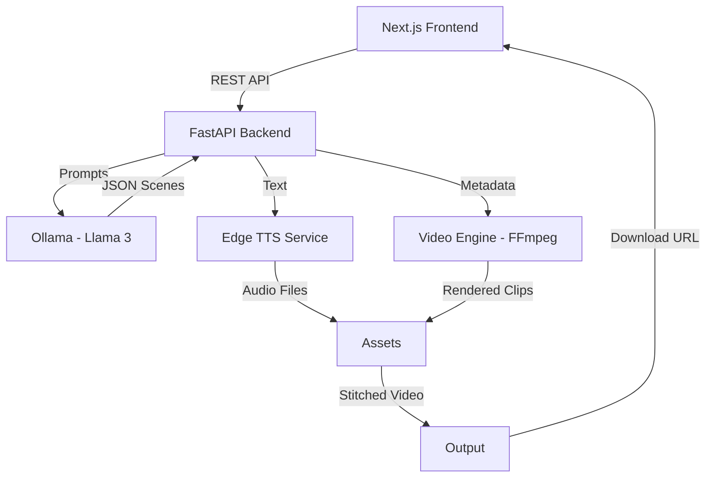

# System Architecture

## 1. Overview
The AI Article to Video Generator is a decoupled system consisting of a React frontend and a Python backend. It utilizes local AI models for processing and FFmpeg for media rendering.

## 2. Component Diagram

## 3. Data Flow
1. **Input**: User submits text via `ArticleInput`.
2. **Analysis**: `SceneBuilder` sends text to Ollama. Ollama returns a JSON list of scenes (title, narration, visual description, emotion).
3. **Audio Generation**: `TTSService` generates an MP3 file for each scene's narration.
4. **Visual Generation**: `VideoRenderer` generates a placeholder frame (or retrieves a stock asset) for each scene.
5. **Clip Assembly**: Each scene is rendered into an individual MP4 clip combining audio and visual.
6. **Final Stitching**: All scene clips are concatenated into one final video using FFmpeg's concat filter.

## 4. Scalability Considerations
- **Job Queues**: In a production environment, video rendering should be moved to a background worker (e.g., Celery/Redis).
- **Storage**: Media assets should be stored in S3 or similar object storage.
- **Concurrency**: FFmpeg is CPU-intensive; limiting concurrent renders is essential.
